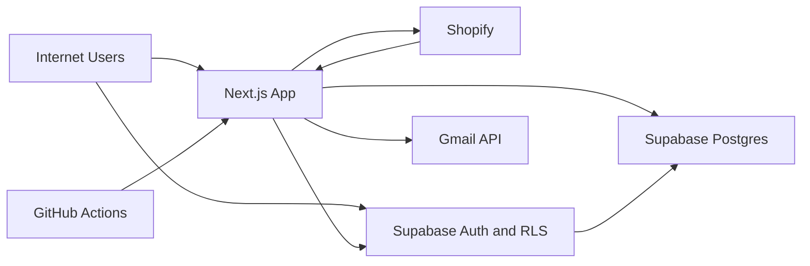

## Executive summary
This single-shop fulfillment console has one critical risk theme: data-integrity compromise through direct Supabase access if current `orders` write policy is reachable from browser-authenticated clients. Secondary high risks are operational abuse of internet-exposed internal worker endpoints protected only by static bearer secrets, and conditional shop-registration abuse in Shopify OAuth/callback flow. Most core business logic has explicit vendor/admin checks in app code, but those checks can be bypassed if DB-side policy and privilege boundaries are overly broad.

## Scope and assumptions
- In-scope paths:
- `app/api/**`
- `app/(public)/apply/**`
- `app/admin/**`
- `app/orders/**`
- `lib/auth.ts`
- `lib/data/**`
- `lib/shopify/**`
- `lib/supabase/**`
- `schema.sql`
- `.github/workflows/**`
- Out-of-scope:
- Vercel account/network configuration details not present in repo
- Supabase project-level IAM and key-rotation settings outside repo
- Shopify Partner/App dashboard settings outside repo
- Confirmed assumptions from user:
- Shopify integration is single-shop fixed.
- `api/internal/*` is internet-reachable and protected only by bearer secret (no IP allowlist/WAF/private network).
- Material assumptions inferred from repo evidence:
- Browser can initialize Supabase client directly using `NEXT_PUBLIC_SUPABASE_URL` + `NEXT_PUBLIC_SUPABASE_ANON_KEY` (`lib/supabase/client.ts`, `app` client components).
- `orders` has a broad RLS write policy (`FOR ALL USING (true) WITH CHECK (true)`) (`schema.sql:283-285`).
- Open questions that can change ranking:
- Are table-level `INSERT/UPDATE/DELETE` grants to `anon/authenticated` revoked in your Supabase project? If revoked, TM-001 likelihood drops significantly.
- Is there external edge protection (Cloudflare/Vercel Firewall) on `api/internal/*` not represented in repo? If yes, TM-002 likelihood drops.

## System model
### Primary components
- Next.js App Router app serving public/auth/admin/vendor pages and API routes (`app/**`).
- Supabase Auth + Postgres with RLS policies and RPC functions (`lib/supabase/*`, `schema.sql`).
- Shopify integration for OAuth, webhook ingest, order/fulfillment sync (`app/api/shopify/**`, `lib/shopify/**`).
- Background job model via DB queues (`webhook_jobs`, `shipment_import_jobs`) processed by internal endpoints (`app/api/internal/**`) called by GitHub Actions (`.github/workflows/**`).
- Gmail API email notifications for approvals/new orders (`lib/notifications/email.ts`).

### Data flows and trust boundaries
- Internet user -> Next.js public/auth endpoints
- Data types: email, password, vendor application profile, session cookies.
- Channel: HTTPS.
- Security guarantees: Supabase auth session; app-side validation for application fields (`app/(public)/apply/actions.ts`, `lib/apply/validation.ts`).
- Validation: regex + required checks only; no repo-evidenced CAPTCHA/rate limit.
- Browser client -> Supabase directly
- Data types: auth session JWT, table queries/subscriptions.
- Channel: HTTPS to Supabase.
- Security guarantees: RLS + table privileges.
- Validation/authorization: policy-dependent; `orders` includes broad write policy (`schema.sql:283-285`), read policies for line items/shipments are vendor/admin scoped (`schema.sql:287-299`).
- Shopify -> webhook endpoints
- Data types: webhook JSON payloads, HMAC signature, shop domain/topic headers.
- Channel: HTTPS.
- Security guarantees: HMAC verification + known-shop check (`app/api/shopify/orders/ingest/route.ts`, `lib/shopify/hmac.ts`, `lib/shopify/shop-domains.ts`).
- Validation: topic allowlist and basic payload shape checks.
- GitHub Actions -> internal worker endpoints
- Data types: bearer secret, control params (`limit/jobs/items`).
- Channel: HTTPS.
- Security guarantees: static bearer-token equality check only (`app/api/internal/**`, `.github/workflows/**`).
- Validation: numeric clamping in handlers.
- App/service layer -> Shopify Admin API
- Data types: access tokens, order/fulfillment payloads, tracking updates.
- Channel: HTTPS.
- Security guarantees: access-token lookup from `shopify_connections` and API error handling (`lib/shopify/fulfillment.ts`).
- Validation: API response status checks and retries.
- App -> Gmail API
- Data types: service-account JWT, recipient email/content.
- Channel: HTTPS.
- Security guarantees: OAuth service-account flow and token caching (`lib/notifications/email.ts`).

#### Diagram

## Assets and security objectives
| Asset | Why it matters | Security objective (C/I/A) |
| --- | --- | --- |
| Order/shipment state (`orders`, `line_items`, `shipments`) | Drives fulfillment correctness and customer delivery outcomes | I, A |
| Tenant boundary (`vendor_id`, role metadata) | Prevents cross-vendor data access and tampering | C, I |
| Shopify access tokens (`shopify_connections.access_token`) | Grants API control over store fulfillment/order operations | C, I |
| Internal worker secrets (`CRON_SECRET`, `JOB_WORKER_SECRET`) | Gates queue processors and resync jobs | C, I, A |
| Auth/session artifacts (Supabase session/JWT metadata) | Determines admin/vendor permissions | C, I |
| Webhook/job payload data (`webhook_jobs.payload`, `fulfillment_requests.raw_payload`) | Contains potentially sensitive customer/order metadata | C, I |
| Availability-critical queue processors (`webhook_jobs`, `shipment_import_jobs`) | Backlog stalls break near-real-time operations | A |
| Audit/operational telemetry (application logs, job errors) | Needed for incident detection and forensics | I, A |

## Attacker model
### Capabilities
- Remote internet attacker can reach public routes and `api/internal/*` (per user context).
- Authenticated low-privilege user (vendor or self-registered pending vendor) can maintain valid session and invoke app/browser Supabase paths.
- If secrets leak (CI, logs, env exposure), attacker can invoke worker endpoints with valid bearer tokens.
- Malicious Shopify-side sender can attempt webhook/OAuth abuse subject to signature/state constraints.

### Non-capabilities
- No assumed direct access to `SUPABASE_SERVICE_ROLE_KEY` by normal browser users.
- No assumed shell access to app runtime host.
- No assumed compromise of GitHub/Vercel admin accounts unless explicitly noted.

## Entry points and attack surfaces
| Surface | How reached | Trust boundary | Notes | Evidence (repo path / symbol) |
| --- | --- | --- | --- | --- |
| Vendor application server action | Public form submit | Internet -> Next.js -> Supabase Auth/DB | Creates auth user + pending application | `app/(public)/apply/actions.ts:9`, `lib/data/vendors.ts:369` |
| Sign-in | Public UI + Supabase auth | Internet -> Browser -> Supabase | Password auth flow | `components/auth/sign-in-form.tsx:28` |
| Shopify webhook ingest | `POST /api/shopify/orders/ingest` | Shopify -> Next.js | HMAC + shop domain checks + queue enqueue | `app/api/shopify/orders/ingest/route.ts:17` |
| Shopify fulfillment callback | `POST /api/shopify/fulfillment/callback` | Shopify -> Next.js | HMAC + known shop + fulfillment request persistence | `app/api/shopify/fulfillment/callback/route.ts:18` |
| Shopify OAuth callback | `GET /api/shopify/auth/callback` | Browser/Shopify -> Next.js -> Shopify/Supabase | Validates state+HMAC, then stores token | `app/api/shopify/auth/callback/route.ts:16`, `lib/shopify/oauth.ts:73` |
| Shipment job submit | `POST /api/shopify/orders/shipments` | Authenticated vendor -> Next.js -> DB queue | Requires auth/vendor checks | `app/api/shopify/orders/shipments/route.ts:21` |
| Shipment job status | `GET /api/shipment-jobs/[id]` | Authenticated user -> Next.js -> DB | Enforces vendor/admin visibility | `app/api/shipment-jobs/[id]/route.ts:8` |
| Internal webhook worker | `GET/POST /api/internal/webhook-jobs/process` | Internet/GitHub -> Next.js worker | Static bearer auth only | `app/api/internal/webhook-jobs/process/route.ts:8` |
| Internal shipment worker | `GET/POST /api/internal/shipment-jobs/process` | Internet/GitHub -> Next.js worker | Static bearer auth only | `app/api/internal/shipment-jobs/process/route.ts:8` |
| Internal resync worker | `GET/POST /api/internal/shipments/resync` | Internet/GitHub -> Next.js worker | Static bearer auth only | `app/api/internal/shipments/resync/route.ts:7` |
| Direct browser Supabase client | Frontend runtime | Browser -> Supabase | Public anon key client initialization | `lib/supabase/client.ts:9` |
| Orders write policy surface | Supabase SQL API/PostgREST | Authenticated/anon DB role -> `orders` | `FOR ALL USING true` policy | `schema.sql:283-285` |

## Top abuse paths
1. Cross-tenant order tampering via DB policy gap
1. Attacker signs in as any authenticated user.
2. Attacker uses Supabase JS/REST directly from browser context.
3. Attacker updates `orders.status` or related fields on other vendors’ orders (if grants permit).
4. Fulfillment state diverges, causing wrong shipment behavior and operational loss.

2. Worker endpoint abuse after secret leak
1. Attacker obtains `CRON_SECRET` or `JOB_WORKER_SECRET`.
2. Calls `api/internal/*` in loops with high batch parameters.
3. Forces repeated job execution and external API calls.
4. Causes queue starvation, rate-limit exhaustion, and operational instability.

3. Conditional rogue-shop onboarding through OAuth callback
1. Attacker completes OAuth callback for non-approved shop (if app install possible).
2. Token is stored in `shopify_connections` without strict fixed-shop pinning.
3. Webhooks from that shop now pass “registered shop” gate.
4. Queue/processors ingest attacker-controlled order streams.

4. Shopify token exfiltration from DB leak path
1. Attacker gains read access to DB backups/SQL endpoint.
2. Extracts plaintext `shopify_connections.access_token`.
3. Calls Shopify Admin API as app installation.
4. Alters fulfillment/order state outside intended workflow.

5. Public application spam/abuse
1. Bot submits high-volume vendor applications and sign-ups.
2. Creates many pending accounts/records and notification load.
3. Admin review queue becomes noisy and incident response degrades.

6. Non-prod webhook bypass misuse
1. Environment configured with webhook test bypass or weak secret fallback.
2. Attacker posts forged webhook payloads to non-prod exposed endpoint.
3. Job/payload stores are polluted; if shared dependencies exist, impact expands.

## Threat model table
| Threat ID | Threat source | Prerequisites | Threat action | Impact | Impacted assets | Existing controls (evidence) | Gaps | Recommended mitigations | Detection ideas | Likelihood | Impact severity | Priority |
| --- | --- | --- | --- | --- | --- | --- | --- | --- | --- | --- | --- | --- |
| TM-001 | Authenticated low-privilege user | Valid session and ability to call Supabase directly; table write grants to `authenticated/anon` not revoked | Writes to `orders` outside app authorization path | Cross-tenant/order integrity compromise; fulfillment mistakes | Order/shipment integrity, tenant boundary | App-side auth checks (`lib/auth.ts`); read-scoped RLS for some tables (`schema.sql:287-299`) | `orders` has `FOR ALL USING (true) WITH CHECK (true)` (`schema.sql:283-285`); browser direct Supabase client exists (`lib/supabase/client.ts`) | Replace with role-scoped write policies; revoke direct table writes for `anon/authenticated`; move writes to vetted RPC/Server Actions only; add migration tests asserting denied cross-tenant writes | Alert on `orders` mutations by non-service roles; monitor anomalous `last_updated_source` and bulk status flips | High (Medium if grants already revoked) | High | critical |
| TM-002 | External attacker with leaked secret / insider | Possession of `CRON_SECRET` or `JOB_WORKER_SECRET`; internet reachability | Abuse `api/internal/*` to trigger worker loops and forced retries | Queue/availability degradation, Shopify API quota burn, operational instability | Availability-critical workers, Shopify API budget, operational telemetry | Bearer token checks and limit parsing (`app/api/internal/*`) | No network-layer restriction; static shared secrets; GET enabled; no per-caller throttling | Restrict endpoints behind private network/IP allowlist; require signed short-lived tokens; disable GET for worker mutations; implement route-level rate limits and secret rotation runbook | Monitor request volume/user-agent/IP for internal routes; alert on repeated high-frequency invocations and job-failure spikes | Medium | High | high |
| TM-003 | Malicious shop operator (conditional) | Ability to complete OAuth install for another shop; valid callback state flow | Inserts unauthorized shop token, then sends valid signed webhooks from that shop | Data poisoning/job pollution; potential operational confusion | Order data integrity, queue integrity | OAuth state+HMAC checks (`app/api/shopify/auth/callback/route.ts`); webhook HMAC + known-shop gate (`app/api/shopify/orders/ingest/route.ts`) | Callback does not enforce strict `shop == configured single shop`; registration trust is DB presence in `shopify_connections` | Enforce strict single-shop pin in callback and webhook path; maintain explicit allowlist table; alert and block unknown shop insert/update attempts | Alert on `shopify_connections` inserts/updates for unexpected shops and first-seen webhook domains | Low (with confirmed single-shop model) | High | medium |
| TM-004 | Attacker with DB read path | Access to DB snapshot/query channel via separate compromise | Exfiltrates plaintext Shopify tokens and rich webhook payload data | Unauthorized Shopify API use + privacy breach | Shopify tokens, customer/order payload data | Service key is server-side only (`lib/shopify/service-client.ts`); webhook authenticity checks | Tokens stored plaintext (`schema.sql:137-143`); payloads stored raw (`schema.sql:533-546`, `schema.sql:498-512`) | Encrypt tokens at application layer with KMS; minimize stored payload fields; apply TTL/retention policy and redaction | Query/audit alerts on sensitive table access; periodic access review for token tables | Medium | High | medium |
| TM-005 | Internet bot attacker | Public access to application form | Automated sign-up/application spam to overload ops | Review queue noise, possible email/cost abuse | Availability (ops), admin workflow integrity | Field validation and duplicate pending-by-email check (`lib/apply/validation.ts`, `lib/data/vendors.ts`) | No explicit CAPTCHA/rate limiting/abuse controls in repo | Add CAPTCHA + IP/email rate limiting + signup throttles; add abuse scoring and temporary blocks | Alert on spikes in `vendor_applications` and sign-up failures/successes by IP cohort | High | Medium | medium |
| TM-006 | External attacker in non-prod/staging | Non-prod endpoint exposure + permissive webhook config | Sends forged webhooks under test bypass or weak secret fallback conditions | Data pollution and false positives in job processing | Queue integrity, test environment reliability | Production denies missing secret (`lib/shopify/hmac.ts`) | Test-mode bypass exists for non-prod; webhook verifier allows fallback secret sources | Remove fallback-to-API-secret; fail closed in all envs with real data; isolate staging credentials/data | Startup config checks + CI guardrail to fail deploy when webhook secret policy is unsafe | Medium | Medium | medium |

## Criticality calibration
- Critical:
- Unauthorized cross-tenant write to `orders`/fulfillment state from low-privilege actor.
- Any path that allows persistent corruption of shipment decision data at scale.
- High:
- Compromise/abuse of internal worker endpoints causing sustained queue and sync disruption.
- Unauthorized onboarding of non-approved shop leading to signed webhook ingestion (even if conditional).
- Shopify token theft enabling API-side manipulation of fulfillment state.
- Medium:
- Public form/signup abuse without account takeover.
- Non-prod webhook bypass misuse where blast radius is limited to staging/test data.
- Data retention/redaction gaps without active exploitation evidence.
- Low:
- Minor security header omissions that do not alter authz boundaries.
- Non-sensitive log verbosity with low exploitability.
- Dev-route exposure blocked in production by build/runtime controls.

## Focus paths for security review
| Path | Why it matters | Related Threat IDs |
| --- | --- | --- |
| `schema.sql` | Source of RLS and write-policy decisions; central to DB trust boundary | TM-001, TM-004 |
| `lib/supabase/client.ts` | Confirms browser-direct Supabase capability | TM-001 |
| `lib/supabase/server.ts` | Distinguishes server action vs component client behavior | TM-001 |
| `lib/auth.ts` | App-layer role/vendor checks used across routes/actions | TM-001, TM-005 |
| `app/api/internal/webhook-jobs/process/route.ts` | Internet-exposed worker gate with static bearer auth | TM-002 |
| `app/api/internal/shipment-jobs/process/route.ts` | Same bearer-only pattern for shipment job processing | TM-002 |
| `app/api/internal/shipments/resync/route.ts` | Same pattern for resync path | TM-002 |
| `.github/workflows/process-webhook-jobs.yml` | Reveals call pattern and secret usage for worker endpoints | TM-002 |
| `.github/workflows/process-shipment-jobs.yml` | Reveals operational trigger cadence and auth header usage | TM-002 |
| `.github/workflows/resync-pending-shipments.yml` | Reveals external reachability assumptions for internal APIs | TM-002 |
| `app/api/shopify/auth/callback/route.ts` | OAuth callback trust decisions and token persistence trigger | TM-003 |
| `lib/shopify/oauth.ts` | Shop-token storage logic and missing fixed-shop pinning | TM-003 |
| `app/api/shopify/orders/ingest/route.ts` | Webhook verification + known-shop gate + queue ingress | TM-003, TM-006 |
| `lib/shopify/hmac.ts` | Signature validation behavior, secret fallback/test-mode logic | TM-006 |
| `lib/data/webhook-jobs.ts` | Queue deduplication, state transitions, retry behavior | TM-002, TM-006 |
| `lib/data/shipment-import-jobs.ts` | Job claim/progress logic affecting operational resilience | TM-002 |
| `app/(public)/apply/actions.ts` | Public signup flow and abuse surface | TM-005 |
| `lib/data/vendors.ts` | Vendor application creation/approval and auth metadata transitions | TM-005 |
