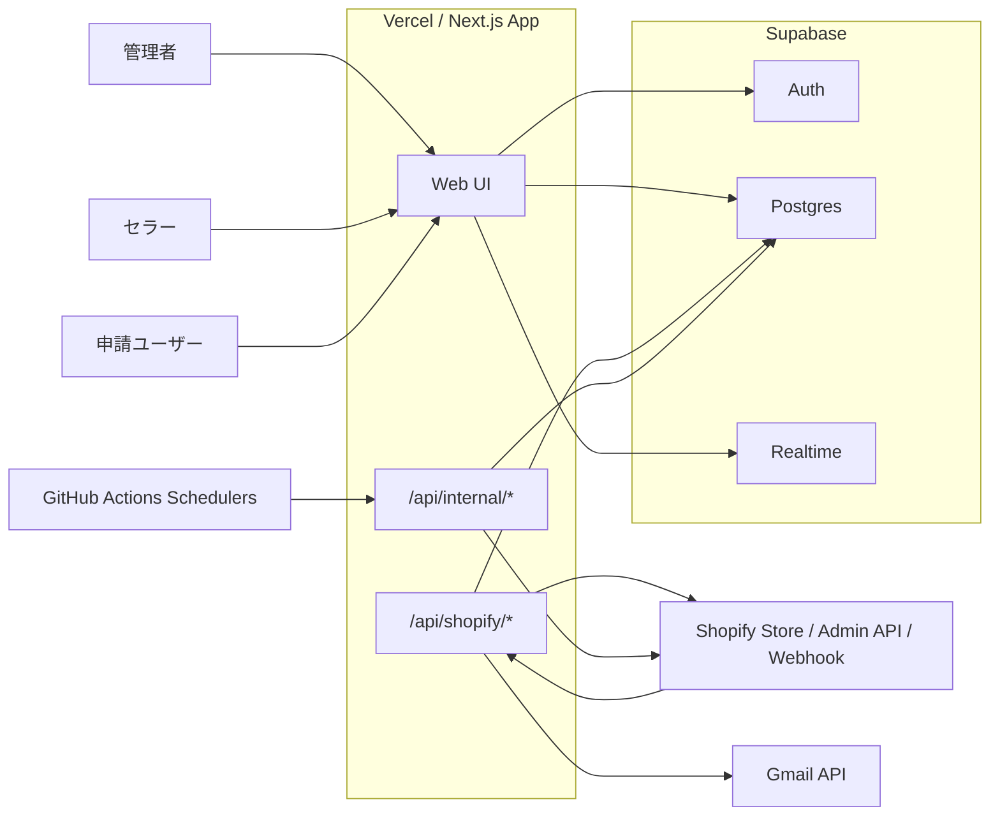

# Live Infrastructure Audit

最終確認: 2026-03-14 JST

## 1. 確認方法
- ローカル設定とリポジトリ実装を確認。
- `gh` / `supabase` CLI はこの環境に未導入だったため、`curl` で GitHub API / Supabase REST API / Vercel デプロイ先を照会。
- 機密値は記載しない。

## 2. Live 判定サマリ
- GitHub Actions の定期 worker 3 本は稼働中。
- Vercel デプロイ先は応答中で、内部 worker API は未認証時に `401` を返す。
- Supabase 上で `webhook_jobs` / `shipment_import_jobs` の pending backlog は 0 件。
- Shopify 接続レコードと注文通知レコードは存在し、注文通知は直近でも `sent` が記録されている。
- CSV インポートとセラー自身の発送取消 / 再送 UI は、現行プロダクトスコープ外として扱うのが正確。

## 2.1 2026-03-15 実装修正
- `fulfillment_orders/cancellation_request_accepted` は実装側でも supported topic に追加した。
- FO webhook は `order_routing_complete` / `hold_released` / `cancellation_request_accepted` を同一経路で受け、order 解決後に shipment resync を起動する。
- Shopify scope はコードが実際に使う最小セットに絞り、`shopify_connections.scopes` との差分は warning/info ログで観測できるようにした。

## 3. Live 構成図

## 4. 現在の live 状態

### GitHub Actions
- `Process Webhook Jobs`: 2026-03-14 10:55 JST 時点の直近定期実行は success。
- `Process Shipment Jobs`: 2026-03-14 10:45 JST 時点の直近定期実行は success。
- `Resync Pending Shipments`: 2026-03-14 10:22 JST 時点の直近定期実行は success。
- `CI`: 2026-03-03 14:53 JST の直近 push 実行は failure。失敗ステップは `Unit tests`。

### Vercel
- `/` は `200 OK`。
- `/orders` は `200 OK`。
- `/api/internal/webhook-jobs/process` は未認証で `401`。
- `/api/internal/shipment-jobs/process` は未認証で `401`。
- `/api/internal/shipments/resync` は未認証で `401`。

### Supabase
- `orders`: 5 件。
- `shipments` の `sync_status=pending`: 0 件。
- `shipments` の `sync_status=error`: 0 件。
- `webhook_jobs` の `status=pending`: 0 件。
- `webhook_jobs` の `status=failed`: 1 件。
- `shipment_import_jobs` の `status=pending`: 0 件。
- `shipment_import_jobs` の `status=running`: 0 件。
- `shipment_import_jobs` の `status=failed`: 4 件。
- `vendor_order_notifications` の `status=error`: 0 件。

## 5. 実データから確認できたこと
- `shopify_connections` には 1 ストア分の接続レコードがある。
- `vendor_order_notifications` は 2026-03-13 まで `sent` が記録されており、新規注文メール通知は live とみてよい。
- 直近の `webhook_jobs` は `orders/updated` / `orders/cancelled` が `completed` で並んでいる。
- 直近の `shipment_import_jobs` は success で処理完了している。
- 失敗して残っている `shipment_import_jobs` は、主に Shopify 側の `Fulfillment order ... has an unfulfillable status= closed` と `発送できる明細が見つかりませんでした`。

## 6. 現行スコープ外として扱うもの
- `CSVインポート`
  - 現状はプレビューとログ記録が中心で、現行の正式運用フローには含めない。
- `セラー自身の発送取消 / 再送 UI`
  - 現行 UI は管理者への修正依頼フローへ寄せており、セラーセルフサービスは要件外。

## 7. 要確認の drift
- 2026-03-14 時点で `shopify_connections.scopes` の live 値は、当時の `shopify.app.toml` より狭く見えた。
- 2026-03-15 時点で `shopify.app.toml` は実装上の最小権限へ整理済み。今後は `shopify_connections.scopes` がその最小権限を満たすかどうかだけを見ればよい。
- 直近 worker は success だが、古い failed job が少数残っている。
- ドキュメント間でスケジュール周期や提供機能の記述に差分があるため、今後はこの live audit を起点に同期した方がよい。

## 8. Shopify 設定の意味
- `fulfillment_orders/cancellation_request_accepted`
  - Shopify の Fulfillment Order に対するキャンセル要求が受理された時に飛ぶ webhook topic。
  - `shopify.app.toml` に topic があると Shopify はアプリへ通知を送る。
  - 現行実装では `SUPPORTED_TOPICS` に含め、他の FO webhook と同様に `order_id` 解決 → `triggerShipmentResyncForShopifyOrder` に流す。
  - つまりこの設定は「キャンセル受理時に Shopify が LIVAPON へ通知し、LIVAPON が FO / shipment メタデータを追随させる」ために使われる。
- `shopify_connections.scopes`
  - これは「そのストアが最後に OAuth / 再認可した時点で実際に付与された権限セット」を保存している値。
  - 一方の `shopify.app.toml` は「アプリが今ほしい権限セット」の宣言。
  - 両者がズレる場合、コード上は新しい scope を前提にしていても、 live トークンは古い権限のまま、ということが起きる。
  - 現行実装では `shopify_connections.scopes` を実行時の拒否条件には使わず、`access_token` ロード時と OAuth callback 時に差分をログ出力する。
  - そのため、今後の再認可判断は「保存されている granted scopes が runtime-required scopes を満たすか」で行えばよい。
